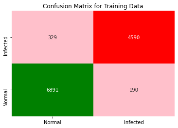
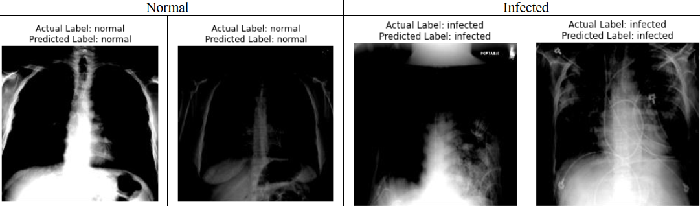
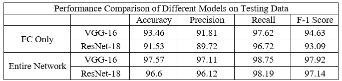
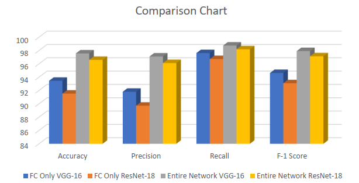
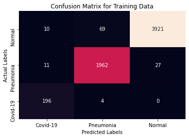
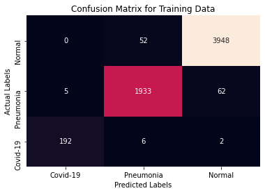
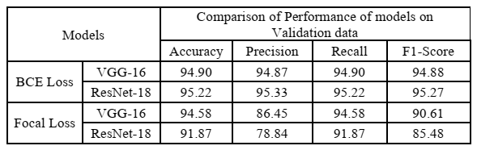
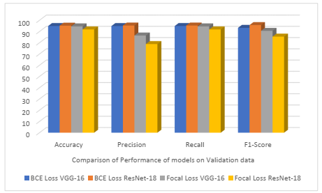

# MSDS19087_COVID19_DLSpring2020
This repository contains code and results for COVID-19 classification assignment by Deep Learning Spring 2020 course offered at Information Technology University, Lahore, Pakistan. This assignment is only for learning purposes and is not intended to be used for clinical purposes.

# Part 1
### Dataset Link: 
You can download dataset from [here](https://drive.google.com/open?id=1-HQQciKYfwAO3oH7ci6zhg45DduvkpnK "Dataset Link")
### Trained Models Link: 
* You can download all trained models from [here](https://drive.google.com/open?id=13udumKPezxW8bQp4LJc1HoToKzhp4_OR)
* Task 1 (Only Fully-connected on VGG-16): You can download model from [here](https://drive.google.com/open?id=1xKddrC4ONzry7hKutvkCgl3H-s5dJvuZ)
* Task 1 (Only Fully-connected on ResNet-18): You can download model from [here](https://drive.google.com/open?id=1-7X0q8F_xqOAdHz-8jVleRm60_78-Gfq)
* Task 2 (Training entire VGG-16 newtwork): You can download model from [here](https://drive.google.com/open?id=1-N6Lg4MxLf9bnxNcNufQkJ0BHavTkG8W)
* Task 2 (Training entire ResNet-18 newtwork): You can download model from [here](https://drive.google.com/open?id=1-QJ40o5zTgLkY_ZqwLS8z5VSasYbO7xz)

## Task description and approach used:
World is suffering from a global pandemic caused by a virus named Covid-19. Its symptoms are much similar to other diseases like viral flu, or SARS, or pneumonia. In this assignment we were given a dataset of 15,000 X-Ray images. These images are labeled as ‘Normal’ and ‘Infected’. What we have to do is to train a model that learn normal X-Ray images and differentiate it with Infected X-Ray images. For this task we used well known deep learning library named as ‘Pytorch’. We also used pre-trained VGG-16 and ResNet-18 models, trained on ImageNet for training of model. Models here simply predict if a person if infected or not. infection may be Pneumonia or Covid-19. Here models do not differentiate if person has Covid-19 or simple Pneumonia. This is done in part 2.
## Results:
### Task 1: Training only Fully connected Layers
#### VGG-16 Accuracy = 93.46
#### VGG-16 F1-Score = 94.63
#### VGG-16 Confusion Matrix

#### ResNet-18 Accuracy = 91.53
#### ResNet-18 F1-Score = 93.09
#### ResNet-18 Confusion Matrix

### Task 2: Training entire network
#### VGG-16	Accuracy = 97.57
#### VGG-16 F1-Score = 97.92
#### VGG-16 Confusion Matrix

#### ResNet-18 Accuracy = 96.60
#### ResNet-18 F1-Score = 97.14
#### ResNet-18 Confusion Matrix

## Predicted Results

## Comparison of Results
From following results we can see when we trained only fully connected layers of model and used pre-trained convolution layers (on ImageNet) then we got less accurate scores in comparison to when we trained entire network on current (Covid-19) dataset. That is because models were pre-trained on ImageNet that doesn’t contain X-Ray like images. Model gives good accuracy without training it on entire network as it already knows how to learn different details in images. We can see in both cases VGG-16 is slightly better than ResNet-18 (in ImageNet ResNet-18 is slightly better). ResNet-18 took slightly less time to train, in comparison to VGG-16.
#### Comparison Table

#### Comparison Chart

# Part 2
### Dataset Link: 
You can download dataset from [here](https://drive.google.com/file/d/1eytbwaLQBv12psV8I-aMkIli9N3bf8nO/view?usp=sharing "Dataset Link")
### Trained Models Link: 
* Task 1 (VGG-16 using Binary Cross Entropy (BCE) Loss): You can download model from [here](https://drive.google.com/open?id=1Im8-1DK2fYOg54WIESqTpoW7UE8fDCzT)
* Task 1 (ResNet-18 using Binary Cross Entropy (BCE) Loss): You can download model from [here](https://drive.google.com/open?id=1-1oMOoR5F7lEPZozwqSs612aej7YnxiD)
* Task 2 (VGG-16 using Focal Loss): You can download model from [here](https://drive.google.com/open?id=1-77n5d8iJFbiSdtJcmTNadTWBfsJExrh)
* Task 2 (ResNet-18 Focal Loss): You can download model from [here](https://drive.google.com/open?id=1-6GohM8ShtP7HIjEfL3DdZl6YmLLXfvk)
## Task description and approach used:
Covid-19 is a type of Pneumonia. Most of its Symptoms are similar to Pneumonia and it is a bit difficult to differentiate between both unless a detailed covid-19 test is taken. This is a timetaking and expansive procedure. Covid-19 effects on lungs of infected person. Idea here is to take X-Ray images of a person's chest and try to predict if person's lungs has symptomps of Covid-19 infection or not. In this part we trained models to detect if an X-Ray image is of infected person or not. If an X-Ray image is of Infected person model also predict whether it is 'Pneumonia' or 'Covid-19'. This is a Multilabel Classification Problem. In this assignment we were given a dataset of 7,457 X-Ray images including 6,200 training, 628 validation and 629 test images. For this task we used very well known deep learning library named as ‘Pytorch’. We also used pre-trained VGG-16 and ResNet-18 models trained on ImageNet for training.
## Results:
### Task 1: Training uning Binary Cross Entropy (BCE) loss 
#### VGG-16 Accuracy = 98.04
#### VGG-16 F1-Score = 96.64
#### VGG-16 Confusion Matrix

#### ResNet-18 Accuracy = 97.95
#### ResNet-18 F1-Score = 97.78
#### ResNet-18 Confusion Matrix

### Task 2: Training using Focal Loss
#### VGG-16	Accuracy = 96.74
#### VGG-16 F1-Score = 90.87
#### VGG-16 Confusion Matrix

#### ResNet-18 Accuracy = 95.87
#### ResNet-18 F1-Score = 88.97
#### ResNet-18 Confusion Matrix

## Predicted Results
## Comparison of Results
Here is a brief comparison of final results obtained on validation data using above mentioned (ResNet-18 and VGG-16) fully trained models using BCE and Focal Loss. From following results we can see when we trained model using BCE Loss the model is predicting well but when we used Focal Loss model become little biased towards covid-19 class as it has smallest no of samples in data. From following comparison we can also see that VGG-16 model has bit more persistence in results as compared to ResNet-18. ResNet-18 works well when trained using BCE Loss.
#### Comparison Table

#### Comparison Chart

